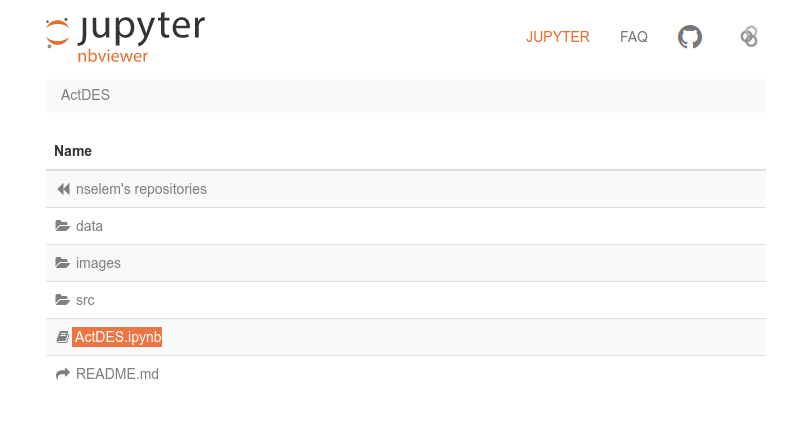
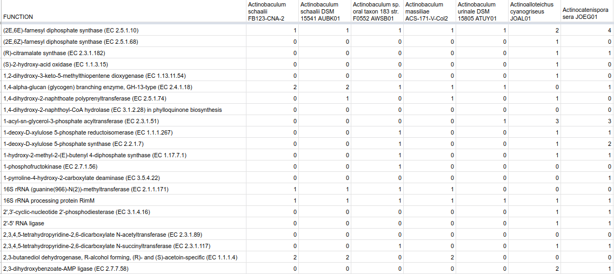

# ActDES-a Curated Actinobacterial Database for Evolutionary Studies   
Scripts used in the curated database of 612 high quality actinobacterial genomes from 80 genera, chosen to represent a broad phylogenetic group with equivalent genome re-annotation. 

Direct to JupyterNotebook 

  

## Download genome annotations from Zenodo  
Annotation, nucleotides and aminoacid data for 612 genomes in ActDES have been deposited at ZENODO repository with the following doi: 

Databases can be donwloaded with these links:  

- [Annotations](https://zenodo.org/record/4081595/files/annotations.tar.gz?download=1)  
- [Bindings](https://zenodo.org/record/4081595/files/bindings.tar.gz?download=1)  
- [Aminoacid Fasta](https://zenodo.org/record/4081595/files/fasta.tar.gz?download=1   )  
- [Nucleotide Fasta](https://zenodo.org/record/4081595/files/nucleotides.tar.gz?download=1    )  

Annotation and Binding files are needed to obtain the frecuencies table. Aminoacids and nucleotide fasta files are provided just in case users may consider them useful.  

## Run ActDes to get abundance table   
- Download [Annotations](https://zenodo.org/record/4081595/files/annotations.tar.gz?download=1) and [Bindings](https://zenodo.org/record/4081595/files/bindings.tar.gz?download=1) databases.  
- Download perl script [F1_FunctionCountBindings.pl](https://raw.githubusercontent.com/nselem/ActDES/master/src/F1_FunctionCountBindings.pl)  
- With the script and databases at the same directory, please decompress both databases.  
`untar`  
`untar `  
- Calculated abundance tables  
`perl F1_FunctionCountBindings.pl ID_all_species12042018`  

## New data base from other RAST genomes  
https://github.com/nselem/myrast 

`docker run -i -t -v $(pwd):/home nselem/myrast /bin/bash`

`1.NCBI_and_RAST.pl  `  
`F0_ExtractFiles.pl`
- Decompress files  
`perl F0_ExtractFiles.pl`  
